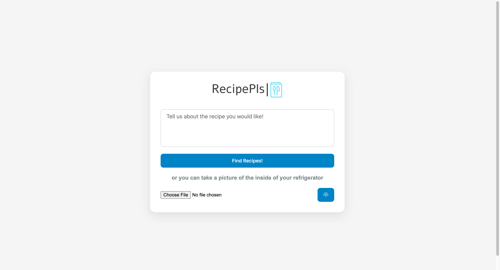
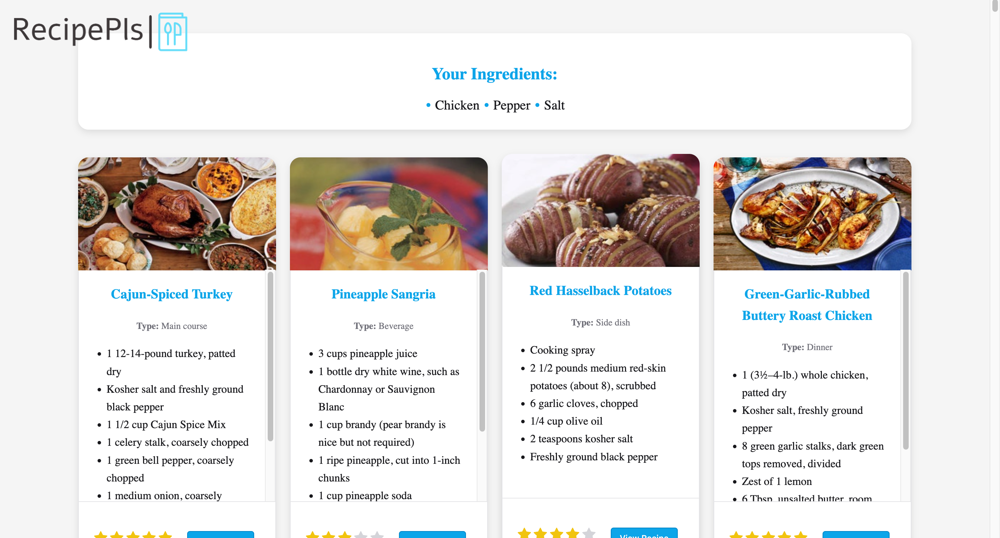
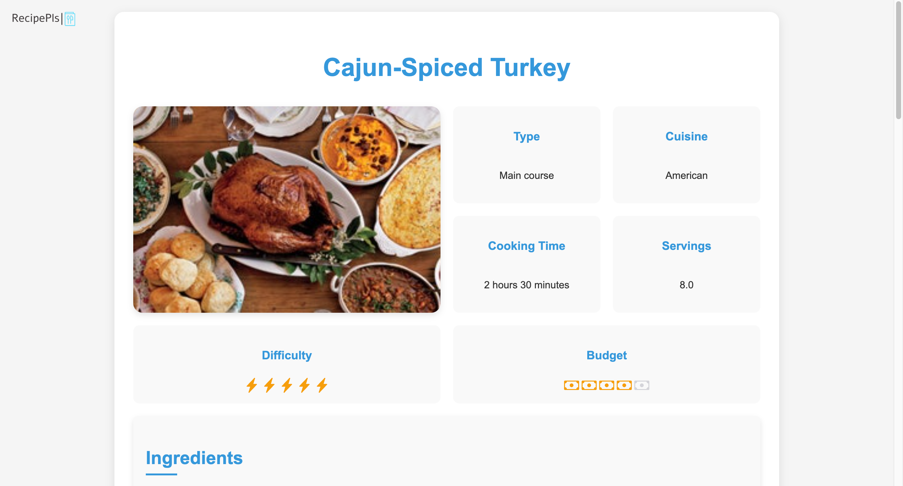
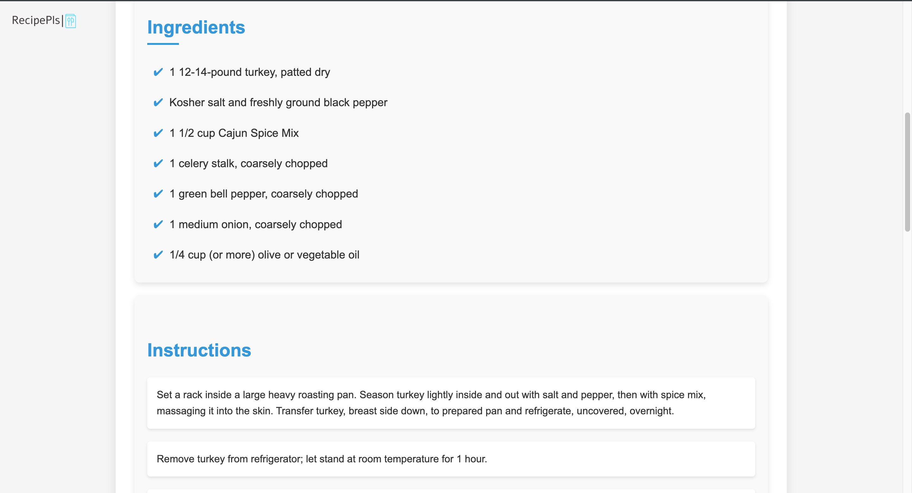
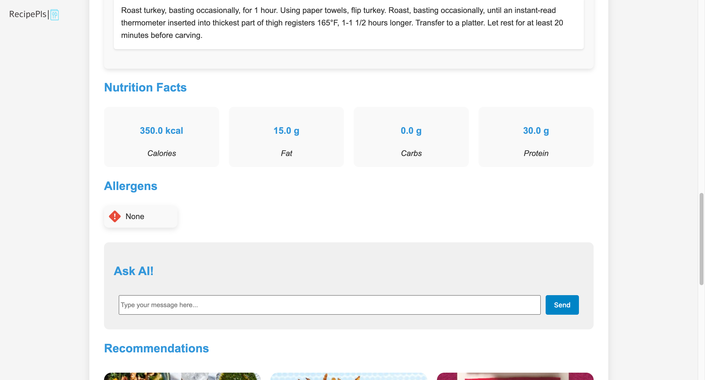
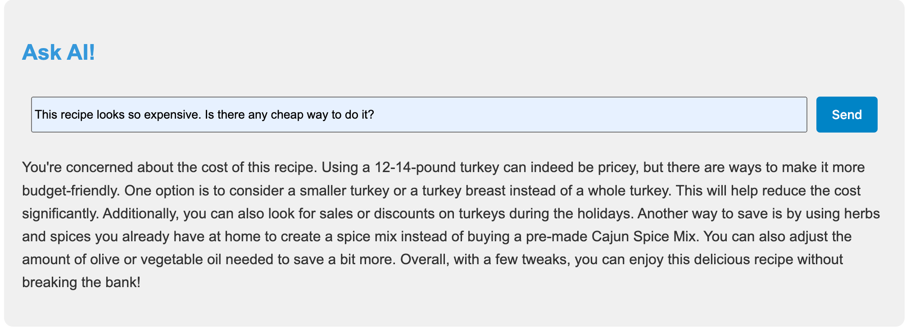
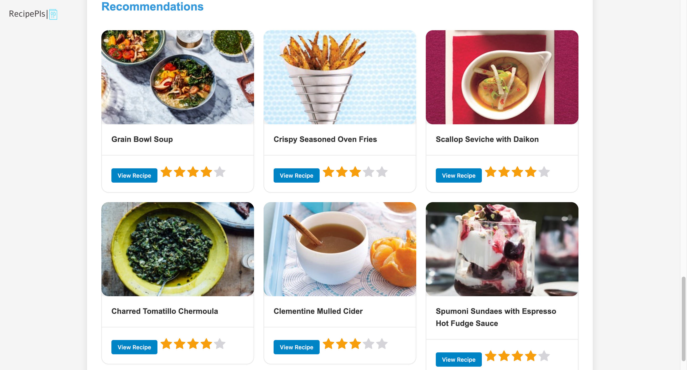

# RecipePls

RecipePls is an advanced, AI-powered recipe recommendation system that leverages Retrieval-Augmented Generation (RAG) methods to provide personalized cooking suggestions. The system uses text and image-based inputs to retrieve relevant recipes from a vast dataset and presents them in a user-friendly way. Powered by Large Language Models (LLMs), RecipePls delivers smart recommendations that align with user-specific preferences, including dietary restrictions, allergens, nutritional goals, and ingredient availability.



## Features

- **Personalized Recommendations**: Recipes are recommended based on user input parameters like available ingredients, unwanted ingredients, budget, difficulty, and nutritional preferences.
- **Question Answering**: Ask any cooking-related questions and receive AI-generated responses for clarity and guidance during meal preparation.
- **Allergen and Dietary Filter**: Filters recipes by avoiding user-specified allergens and unwanted ingredients.
- **Nutritional Adjustments**: Customize your search based on desired calories, fat, carbs, and protein levels.
- **Diverse Cuisine Options**: Choose recipes from a wide range of cuisines.
- **Difficulty and Budget Options**: Filter recipes based on how much time and budget you have for cooking.

## Technology Stack

- **Milvus**: Used for managing large-scale vector databases and performing efficient nearest neighbor searches on recipe embeddings.
- **Groq API**: Facilitates function-calling tools for clear input and handles AI-based question-answering and embedding customization.
- **Google Generative AI (Gemini)**: Used for generating text embeddings and handling image inputs.

## LLM Selection Process

Initially, this project used Milvus for recipe retrieval, while an LLM was responsible for formatting the recipes. I started with Google’s Gemini API for this task, but encountered persistent issues during Retrieval-Augmented Generation (RAG) operations. After some research, I found out that Gemini has problem with RAG operations, so I decided to switch to OpenAI’s API. Although OpenAI was fast, its costs were prohibitive for a small-scale project like this.

I then discovered the Groq API, which provided excellent performance at no cost, making it a perfect fit. To optimize further, I ran the entire dataset through Groq once, extracting key recipe features (calories, servings, etc.) and saved them to a CSV file. This approach eliminated the need to call the LLM repeatedly for these details during user searches, significantly reducing latency.

In the final setup, OpenAI handles image input, Gemini is used for embeddings, and Groq powers function calling and the "Ask AI!" feature. This combination ensures speed, efficiency, and cost-effectiveness for the project.

## Dataset

RecipePls uses a customized dataset that consists of 13,000 recipes, including details like:

- **Title**: The name of the recipe.
- **Ingredients**: Cleaned list of ingredients.
- **Instructions**: Step-by-step cooking instructions.
- **Cooking Time**: Estimated preparation and cooking time.
- **Nutrition Information**: Calories, fat, carbs, and protein content per serving.
- **Difficulty**: Rating from 1 to 5 indicating how hard the recipe is to prepare.
- **Budget**: Rating from 1 to 5 indicating the cost of ingredients.
- **Allergens**: Information on allergens present in the recipe.
- **Type**: Type of dish (e.g., appetizer, main course, dessert).
- **Servings**: Number of servings the recipe makes.
- **Image**: A visual representation of the recipe.

The original dataset can be found here: [Kaggle Food Ingredients and Recipe Dataset](https://www.kaggle.com/datasets/pes12017000148/food-ingredients-and-recipe-dataset-with-images?resource=download).

## Acknowledgments

This project was completed during my internship at [ARDICTECH](https://www.ardictech.com/), and I would like to express my deep gratitude for their support and guidance throughout the process. I would also like to thank [Mirza Atlı](https://mirza.town/) for his unwavering mentorship and continuous encouragement during my internship. His expertise and guidance have been invaluable to the success of this project.

## Images









## Setup and Usage

RecipePls can be accessed either through a local installation or an online web interface. You can access the online web version through this link: [RecipePls Online](https://ai-dev.iot-ignite.com/recipe_please). To run it locally, you will need both a Groq API key and a Gemini API key, along with some necessary libraries.

### Prerequisites

- Python 3.x
- [Milvus](https://milvus.io/)
- [Sentence Transformers](https://www.sbert.net/)
- [Groq Python SDK](https://groq.com/)

## Installation

Follow these steps to install and set up RecipePls on your local machine.

### Prerequisites

- **Python 3.x**: Make sure Python is installed on your machine.
- **Milvus**: Vector database for storing recipe embeddings.
- **Groq API Key**: You’ll need to create an account and get an API key from [Groq](https://groq.com/).
- **Google Generative AI API Key**: Sign up for access to Google Generative AI (Gemini).

### Steps

1. **Clone the Repository**
   
   Clone the `RecipePls` repository to your local machine.
   ```bash
   git clone https://github.com/your-username/RecipePls.git
   cd RecipePls
2. **Create a Virtual Environment** (Optional but recommended)
   
   Set up a virtual environment to keep your dependencies isolated.
   ```bash
   python3 -m venv env
   source env/bin/activate  # On Windows, use `env\Scripts\activate`
3. **Install the required dependencies**
   
   Make sure you have pip installed and up to date. Then run:
  ```bash
  pip install -r requirements.txt
```
4. **Set up environment variables**
   
   Add your API keys for Groq and Gemini by exporting them as environment variables:
   ```bash
   export GROQ_API_KEY='your_groq_api_key'
   export GOOGLE_API_KEY='your_google_api_key'
   ```
   On Windows, use:
   ```bash
   set GROQ_API_KEY=your_groq_api_key
   set GOOGLE_API_KEY=your_google_api_key
   ```
5. **Install and set up Milvus**
   
   Follow the [Milvus installation guide](https://milvus.io/docs/milvus_lite.md) to set up the Milvus vector database on your machine. Ensure it is running before proceeding to the next step.
6. **Run the application:**
   
   After completing the setup, you can start the application and access the recipe recommendation system.
   ```bash
   export FLASK_APP=recipe_server
   export FLASK_ENV=development
   flask run
   ```
Your setup is now complete! The system should now be ready to process and recommend recipes based on user preferences.

### Usage

Once the application is running, you can input various parameters including available ingredients, preferred cuisine, unwanted ingredients, allergens, meal type, budget, difficulty  and nutritional goals to receive tailored recipe recommendations. Here is an example prompt: 
```bash
I have chicken, tomatoes, and spinach. I want to make an Italian dinner recipe that's easy to cook, within my budget, and ready in a short time. I want the meal to have around 500 calories, low fat, moderate carbs, and high protein. Please avoid using mushrooms, onions, gluten, and dairy as I have allergies to these ingredients.
```
You can also upload images of your ingredients (e.g., the contents of your refrigerator). RecipePls will automatically detect the ingredients and suggest recipes accordingly.

### License

This project is licensed under the AGPL-3.0 License - see the `LICENSE` file for details.


